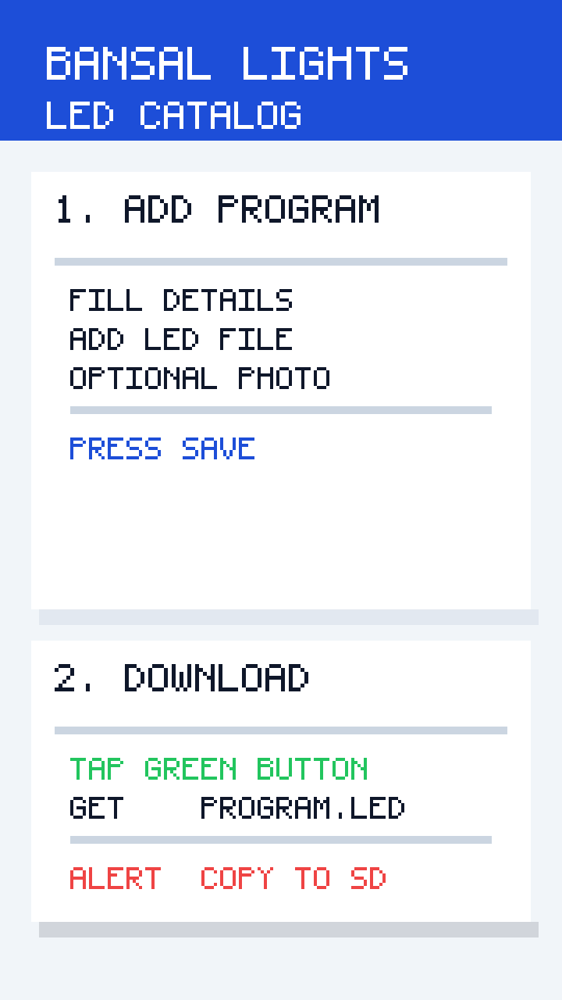

# Bansal Lights - LED Catalog

Simple React + Tailwind PWA that lets the Bansal Lights team store, preview, download, and manage LED programs entirely in the browser (localStorage only). Works great on Android phones and laptops.



## Features
- Mobile-first single page app with big bilingual (English | हिंदी) controls and helpful emojis.
- Built with React + TypeScript + Vite, styled with Tailwind CSS and shadcn-inspired UI components.
- Stores program name, LED file, optional notes, and optional JPG/PNG photo offline in `localStorage`.
- One-tap download that always delivers `00_program.led` for T-1000 / T-8000 controllers.
- Delete with confirmation plus a hidden panic button (top-right `Reset`) to clear all data.
- Installable PWA with offline support (service worker + manifest).

## Getting Started (Developers)
1. Install Node.js 18+ and npm.
2. Clone this repo and run `npm install`.
3. Start the dev server with `npm run dev`.
4. Visit the printed local URL (usually `http://localhost:5173`).
5. Run `npm run build` for a production bundle (outputs to `dist/`).

> Vite handles the TypeScript build automatically—no manual compilation step required.

## Deploy on Netlify (5 Steps)
1. Run `npm run build` to create the production `dist` folder.
2. Log into Netlify and click “Add new site” → “Deploy manually”.
3. Drag-and-drop the entire `dist` folder into the upload area.
4. Wait for the upload to finish and note the generated Netlify URL.
5. Open the site on your phone; tap the install/share options as needed.

> Tip: If you prefer CI/CD, set `npm run build` as the build command and `dist` as the publish directory in Netlify’s settings.

## Add to Android Home Screen
1. Open the deployed site in Chrome on your Android phone.
2. Tap the “⋮” menu in the top-right corner.
3. Choose “Add to Home screen” (or “Install app”).
4. Confirm the name “Bansal Lights” and tap “Add”.
5. Chrome will place the icon on your home screen—launch it like any other app.

## Troubleshooting
- **Browser says storage is full:** Delete older programs from the app or press the hidden `Reset` button (top-right corner of the header) to clear local data.
- **Download button does nothing:** Some browsers block auto-downloads. Ensure pop-ups/downloads are allowed, then try again.
- **Photos refuse to upload:** Only JPG/PNG files up to 2 MB are accepted.
- **Offline mode not working:** Confirm the service worker is active (Chrome → “⋮” → “Install app”). Refresh once while online so assets can be cached.

## User Testing Checklist
- [ ] Can add a program with all fields filled.
- [ ] Can add a program with only the required fields.
- [ ] Saved programs appear in the grid on phone and laptop.
- [ ] Download button saves a file named `00_program.led`.
- [ ] Delete button removes a program after confirmation.
- [ ] Reloading the browser keeps the saved programs (localStorage).
- [ ] Works smoothly on Android phone (portrait) and on laptop.
- [ ] App can be installed to the Android home screen and opens offline.

## Project Structure
```
.
├── components.json
├── index.html
├── netlify.toml
├── package.json
├── public/
│   ├── icons/
│   │   ├── icon-192.png
│   │   └── icon-512.png
│   ├── manifest.json
│   └── service-worker.js
├── src/
│   ├── App.tsx
│   ├── components/
│   │   └── ui/
│   │       ├── button.tsx
│   │       ├── card.tsx
│   │       ├── input.tsx
│   │       ├── label.tsx
│   │       └── textarea.tsx
│   ├── index.css
│   ├── lib/
│   │   └── utils.ts
│   ├── main.tsx
│   └── vite-env.d.ts
├── tailwind.config.js
├── tsconfig.json
├── tsconfig.node.json
└── docs/
    └── screenshot.png
```

## Testing Notes
- No automated tests are included (requirement: manual testing only).
- Use the checklist above while verifying a new deployment.
- Check the browser console (`console.log`) for action confirmations or errors.

## License
MIT – modify freely for the Bansal Lights team.
