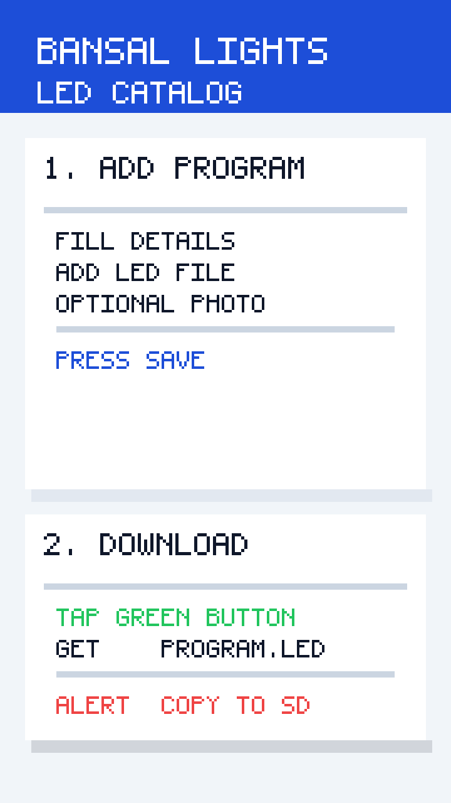

# Bansal Lights LED Catalog

Modern LED-program catalog for the Bansal Lights team. The app stores `.led` controller files, product photos, and bilingual notes entirely in the browser so technicians can manage their library from a phone even when offline. Production deployments are served via the Cloudflare Pages project `led-catalog` (default domain: `https://led-catalog.pages.dev/`, swap for your custom domain as needed).



## What You Get
- 📱 **Mobile-first interface** with large bilingual (English | हिंदी) labels and emoji cues.
- 💾 **Offline catalog**: LED programs live in `localStorage`; nothing is sent to a server.
- 📥 **One-tap download** that always exports `00_program.led` for T-1000/T-8000 controllers.
- 📷 **Optional photo & notes** to identify how a program looks on-site.
- 🔐 **Reset switch** (hidden button) to wipe stored data if a device is being handed over.
- 🚀 **CI-backed deployment** to Cloudflare Pages on every push/merge to `main`.

## Tech Stack
| Area | Choice | Notes |
| ---- | ------ | ----- |
| UI | React 18 + TypeScript | SPA bootstrapped with Vite |
| Styling | Tailwind CSS + shadcn-inspired primitives | Custom component variants live in `src/components/ui` |
| State | React hooks + browser `localStorage` | No backend services required |
| Tooling | Vite 5 | Handles dev server, bundling, and TypeScript |
| Hosting | Cloudflare Pages (free tier) | Automated by GitHub Actions workflow `deploy.yaml` |

## Local Development
1. Install Node.js 18 (or newer LTS) and npm.
2. Clone the repo and install dependencies:
   ```bash
   npm install
   ```
3. Start the dev server:
   ```bash
   npm run dev
   ```
4. Open the printed URL (default `http://localhost:5173`). Changes hot-reload automatically.
5. Generate a production bundle at any time with:
   ```bash
   npm run build
   ```

> Tip: Run `npm run build` before pushing to catch type or bundling errors locally.

## Deployment
### Production
- Hosted on Cloudflare Pages at `https://led-catalog.pages.dev/` (or your custom domain).
- Build command: `npm run build`
- Output directory: `dist`
- SPA routing handled automatically by Cloudflare Pages.

### Continuous Deployment (GitHub Actions → Cloudflare Pages)
Workflow file: `.github/workflows/deploy.yaml`

1. Create a Cloudflare API token with the **Cloudflare Pages: Edit** and **Workers KV Storage: Read/Write** permissions.
2. In the GitHub repository, add secrets:
   - `CLOUDFLARE_API_TOKEN`: the token created above.
   - `CLOUDFLARE_ACCOUNT_ID`: the account ID for the Cloudflare tenant hosting the project.
3. Push to `main` (directly or via merge). The workflow:
   - Checks out the repo.
   - Installs dependencies with `npm ci`.
   - Builds the production bundle.
   - Publishes `dist/` using `cloudflare/pages-action@v1` with Wrangler 4.x.
4. Preview deploys are generated automatically for pull requests via Cloudflare Pages branch deploys.
5. Monitor the Actions tab for the “Deploy to Cloudflare Pages” job. A green run equals a successful release.

## Testing & Quality
- No automated tests today; rely on manual smoke testing.
- Manual QA checklist:
  - [ ] Add a program with all fields (file, photo, notes).
  - [ ] Add a program with only required fields.
  - [ ] Refresh the page and confirm saved programs persist.
  - [ ] Download button produces `00_program.led`.
  - [ ] Delete confirmation works.
  - [ ] Hidden `Reset` button clears all data.
  - [ ] App behaves correctly on Android (portrait) and desktop.
  - [ ] Install as PWA and launch offline.
- Watch the browser console logs for “✅/❌” messages when debugging.

## Step-by-Step Tutorial (for Dad)
These friendly steps walk through the common job: adding a fresh LED program, copying it to an SD card, and double-checking that everything worked. Keep this page open on your phone or print it out for quick help.

### A. Add a new program in the app
1. **Open the LED Catalog app** on your phone or computer. If you use it as a shortcut on your home screen, tap that icon.
2. **Press “Add Program”.** A clean form will appear.
3. **Name the program.** Type something simple that you will remember, like “Diwali Gate 2024”.
4. **Pick the `.led` file.** Tap “Choose File”, then select the program file you received from the designer or copied from another device.
5. _(Optional)_ **Add a photo or note.** A quick picture of the installed lights or a short message like “Use on Panel A” helps later.
6. **Save.** Tap “Save Program”. You will see the new card appear on the home screen.

### B. Copy the program to an SD card
1. **Insert the SD card** from the T-series controller into your phone (with an adapter) or a computer.
2. **Tap the “Download” button** on the new program card. The app always names the file `00_program.led`, which the controller expects.
3. **Choose the SD card as the destination.** On a phone, select “Files” → SD card. On a computer, save to the drive letter that matches the SD card.
4. **Wait for the copy to finish.** You should see a short progress bar or a “Download complete” message.

### C. Check that everything worked
1. **Open the SD card folder** in your Files app or File Explorer.
2. **Confirm the file name.** Make sure `00_program.led` is listed. If another version already existed, delete the old one so only the fresh file remains.
3. **Look at the file size.** It should not be zero bytes. If it shows `0 KB`, copy the file again.
4. **Safely remove the SD card.** Use “Eject” on a computer or “Unmount” on a phone before pulling the card out.
5. **Test on the controller.** Insert the SD card into the LED controller, power it on, and press “Play”. The lights should follow the new pattern. If not, repeat the download and copy steps.

> Quick reminder: the app keeps all saved programs inside the device. If you clear the browser data or switch phones, re-download any programs you need from your backups.

## File Layout
```
.
├── .github/workflows/deploy.yaml # CI pipeline for Cloudflare Pages
├── public/
│   ├── manifest.json           # PWA metadata (name, colors, icons)
│   └── service-worker.js       # Caches static assets for offline support
├── src/
│   ├── App.tsx                 # Core catalog experience
│   ├── components/ui           # Button/Card/Input/Label/Textarea primitives
│   ├── index.css               # Tailwind base layers + custom theme tokens
│   ├── lib/utils.ts            # Tailwind class merger
│   └── main.tsx                # Vite bootstrap (React DOM render)
├── tailwind.config.js          # Tailwind theme and shadcn tokens
├── wrangler.toml               # Cloudflare Pages Functions config (if needed)
└── docs/screenshot.png         # Marketing/README image
```

## Operational Notes
- Data lives only in the user’s browser. Clearing cache or switching devices requires manual export/import.
- Rotate the Cloudflare API token on a regular cadence and update the GitHub secret.
- Monitor Cloudflare Pages analytics (bandwidth/requests) monthly to ensure the project stays within the free tier.
- Update this README, `AGENTS.md` and `docs/agents/deploy.md` whenever automation or operating practices change.

## Contingency: Rebuilding the Cloudflare Pages Project
If the Cloudflare Pages project is deleted or the token expires, follow these steps to restore automated deploys:

1. **Back up the current production bundle**
   - Run `npm run build` locally to regenerate `dist/`.
   - Archive the output for safekeeping (attach to a GitHub Release if desired).
2. **Create a fresh Cloudflare Pages project**
   - Cloudflare Dashboard → Pages → **Create a project** → *Connect to Git*.
   - Select this repository, set build command to `npm run build`, and output directory to `dist`.
3. **Provision a new API token**
   - Generate a token with **Cloudflare Pages: Edit** and **Workers KV Storage: Read/Write** permissions.
   - Update the `CLOUDFLARE_API_TOKEN` and `CLOUDFLARE_ACCOUNT_ID` secrets in GitHub.
4. **Trigger the pipeline**
   - Push an empty commit or retrigger the latest workflow run from the Actions tab.
   - Confirm the deployment succeeds and the production domain serves the latest build.

> Tip: If you prefer manual deploys, use `npx wrangler pages deploy dist` after building locally.

## License
MIT – tailor it freely for the Bansal Lights team.
